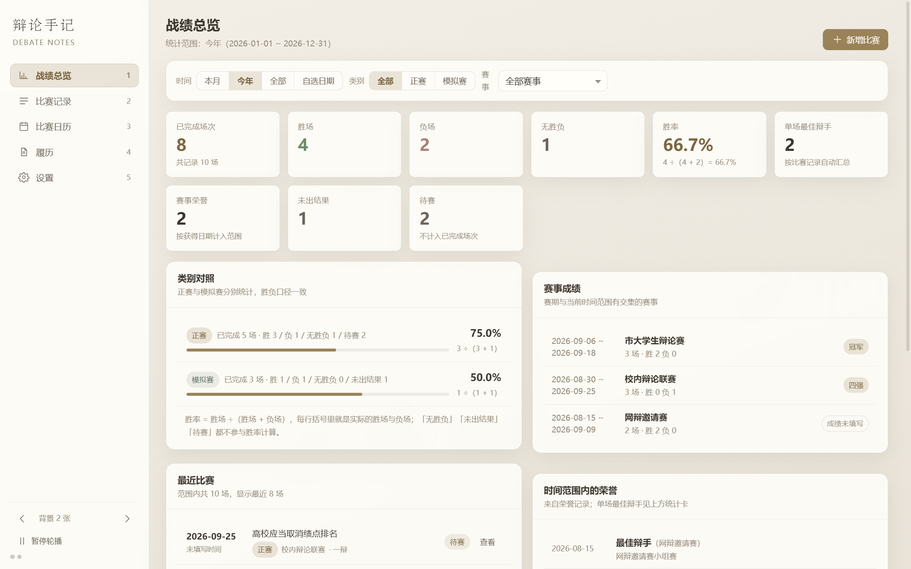
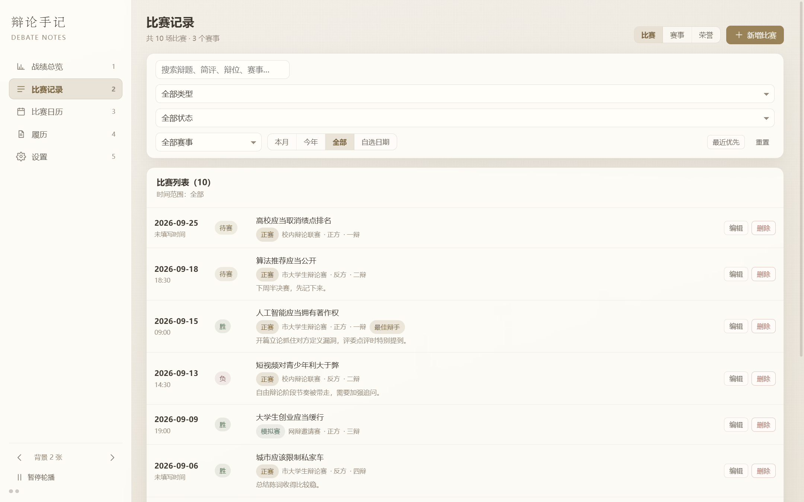
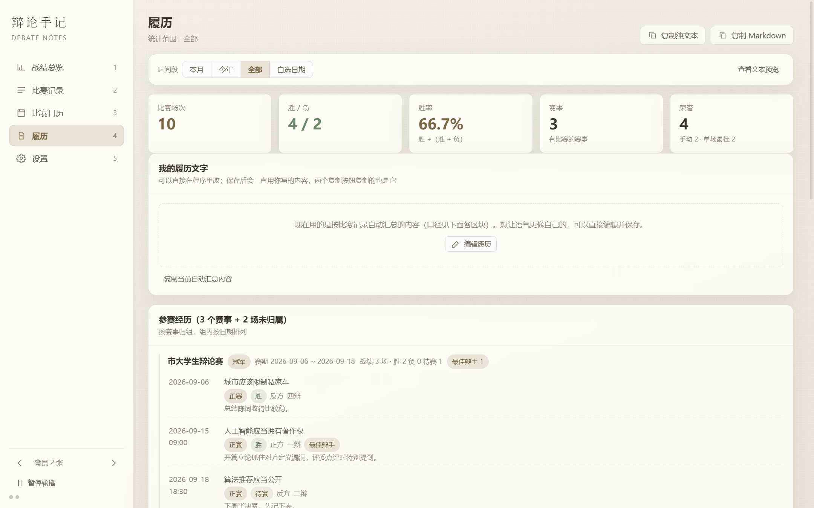
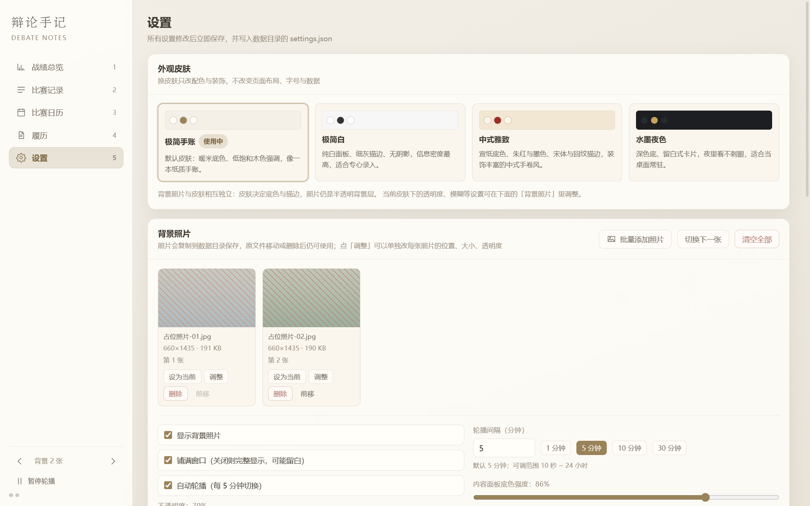
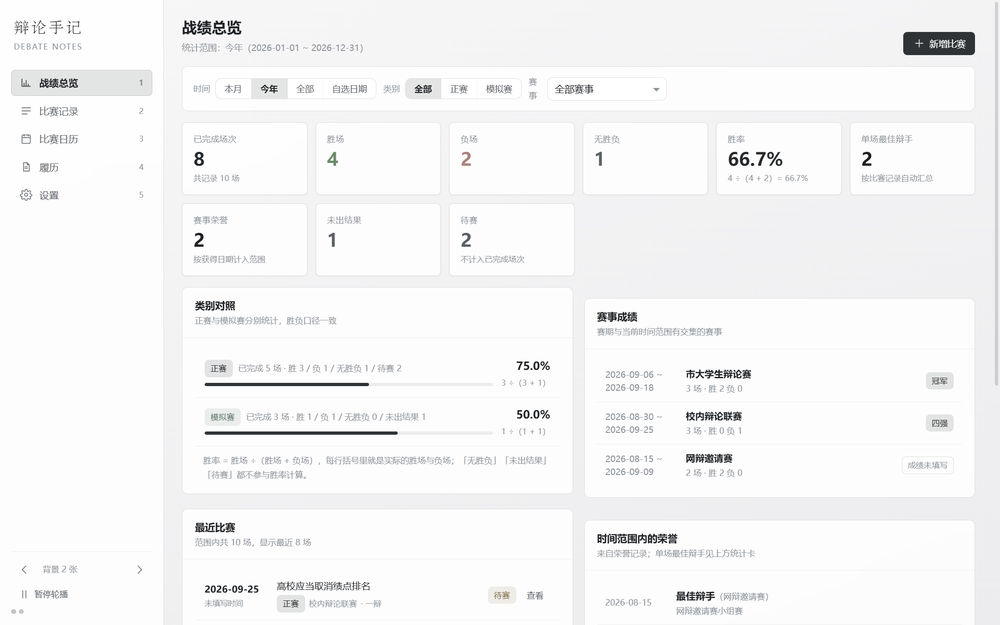
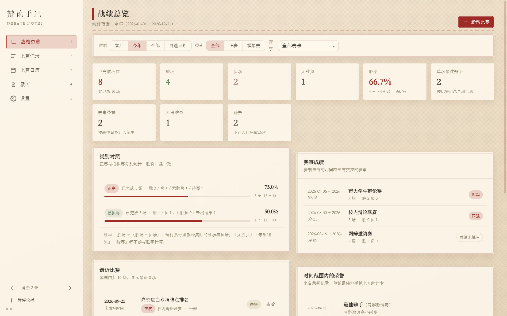
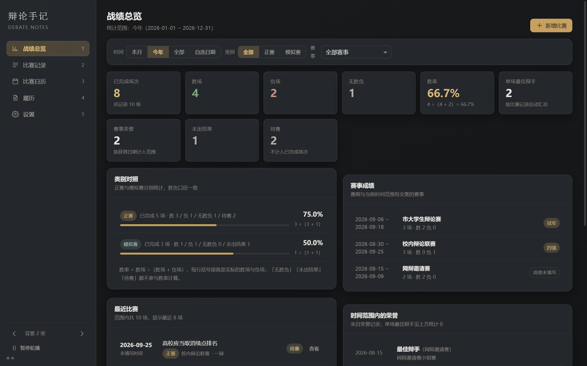

# 辩论手记 · Debate Notes

一个给辩手自己用的**离线**比赛记录程序：记比赛、看胜率、翻日历、攒履历、换皮肤。
Windows 桌面应用（Electron + React + TypeScript + SQLite），**不联网、不登录、没有手机端**，所有数据只存在你自己电脑上的一个文件夹里。

▶ **演示视频**（1080p，2 分 05 秒）：[debate-notes-1.0.0-demo.mp4](https://github.com/shisisishi/debate-notes/releases/download/v1.0.0/debate-notes-1.0.0-demo.mp4) · [封面图](https://github.com/shisisishi/debate-notes/releases/download/v1.0.0/debate-notes-1.0.0-cover.png)



## 功能

| 页面 | 说明 |
| --- | --- |
| **战绩总览** | 胜率、总场次、最佳辩手次数，按时间范围（本月 / 今年 / 全部 / 自选日期）切换；类别对照（正赛 / 模拟赛）把胜率算式直接写出来；赛事成绩与荣誉一览 |
| **比赛记录** | 每场记：日期（可选开赛时间）、辩题、正赛 / 模拟赛、所属赛事、正反方、辩位、比赛结果、是否最佳辩手、简评；支持搜索、筛选、排序，筛选条件会记住 |
| **比赛日历** | 月视图与周视图，待赛、胜、负、无胜负一眼分色，点日期直接开新比赛 |
| **履历** | 按荣誉、赛事成绩、比赛经历自动生成，也可以手动改写（自动生成的内容随时可恢复） |
| **设置** | 四套皮肤（极简手账 / 极简白 / 中式雅致 / 水墨夜色）、背景照片与轮播、每张照片单独调整位置 / 大小 / 透明度 / 模糊 / 缩放方式、可扩展的选项（赛事、辩位、类别等）、自动备份、导出与恢复、**数据目录可搬到 D 盘** |

细节：

- 比赛结果：待赛 / 未出结果 / 胜 / 负 / 无胜负；**胜率 = 胜 ÷（胜 + 负）**，待赛不计入已完成场次。
- 设置类改动（皮肤、照片调整、筛选条件等）即时生效并自动保存。
- 每天首次启动自动把数据打包成 `.zip` 备份，默认保留最近 30 份；也可以手动导出整包、从文件恢复（恢复前自动为当前数据再做一份安全备份，损坏的备份不会覆盖你的数据）。
- 照片只保存在数据目录里，原图删掉也不影响；支持 jpg / png / gif / bmp / tiff / heic（HEIC 会自动转码）。
- 示例数据可以一键写入 / 重新写入 / 全部删除，方便先看看效果。






四套皮肤（左起：极简手账 / 极简白 / 中式雅致 / 水墨夜色）：






## 下载

到 [Releases](https://github.com/shisisishi/debate-notes/releases) 下载最新版（`1.0.0`）：

- **`debate-notes-1.0.0-setup.exe`**（安装版）：可选安装位置，创建开始菜单与桌面快捷方式，可从「应用和功能」卸载（**卸载不会删除你的数据**）
- **`debate-notes-1.0.0-portable.exe`**（免安装版）：双击即用，适合放 U 盘

文件名是英文，装好之后程序名与快捷方式都是「辩论手记」。系统要求：Windows 10 / 11 64 位。

程序没有代码签名证书，首次运行如果出现 SmartScreen 提示（「Windows 已保护你的电脑」），点「更多信息 → 仍要运行」即可。

## 数据放在哪

默认在 `%APPDATA%\DebateNotes`：

```
database.sqlite   比赛、赛事、荣誉等数据
settings.json     界面与设置（皮肤、背景、统计范围等）
photos\           背景照片（复制进来的副本）
backups\          自动备份与安全备份（.zip）
seed.json         示例数据写入标记
runtime\          Chromium 运行时缓存（可随意删除）
```

想放到别的盘（比如 C 盘紧张）：**设置 → 数据与关于 → 更改数据目录…**，选一个文件夹，程序会把整套数据复制过去，重启后生效；原位置会保留一份，界面会标出「自定义位置」。选的文件夹里如果已经有本程序的数据，会直接改用它而不会覆盖。

## 开发

需要 Node.js 20+（开发时用的是 24.x）与 Windows。

```powershell
cd app
npm install
npm run dev            # 开发模式（热更新）
npm run typecheck      # 三个 tsconfig 全量类型检查
npm run build          # 只用 electron-vite 构建（产物在 out/）
npm run dist           # 构建并打包出 NSIS 安装版 + 免安装版（产物在 app/dist/）
npm run test:e2e       # Playwright 端到端测试（49+ 个用例，Windows 上串行跑）
```

首次跑测试或想看到示例照片效果前，先生成两张占位照片（仓库里**不包含**任何个人照片）：

```powershell
npm run sample-photos  # 往 ../sources 写两张 660×1435 的中性占位图
```

目录结构：

```
app/                程序本体（Electron 主进程 + 渲染进程 + 工具脚本）
  src/main/         主进程：SQLite 仓库、备份、照片、示例数据、IPC
  src/preload/      只暴露一个白名单 invoke 通道
  src/renderer/     React 界面（pages / components / store / styles.css）
  e2e/              Playwright 端到端测试
  tools/            打包自检、数据目录 dump、升级自检、截图、占位照片等脚本
docs/screenshots/   界面截图（验收截图由测试生成，不随仓库发布）
sources/            示例照片来源目录（只有说明文件，个人照片未包含）
使用说明.md          给最终用户看的说明书
```

技术栈：Electron 44 · React 19 · TypeScript 5.9 · electron-vite 5 · SQLite（`node:sqlite`，无第三方数据库依赖）· electron-builder 26。

## 隐私

- 程序完全离线：不联网、不登录、不埋点、没有云同步与手机端。
- 仓库里不包含任何个人照片与个人数据；截图使用中性占位图重新生成。
- 打包版启动时只用本机文件读写。

## 说明

个人自用项目，没有指定开源许可证（默认保留所有权利）；代码可以看，请勿直接当作自己的作品发布。有问题欢迎开 Issue。

## 作者的其他项目

- **[stm32-learning-notes](https://github.com/shisisishi/stm32-learning-notes)**
  —— 从零开始的 STM32 嵌入式学习笔记：电路基础 + 电控外设（GPIO/定时器/串口/I2C/ADC）+ PID 控制。
  含可编译运行的纯 C 仿真代码与实验数据。
- 个人主页：[@shisisishi](https://github.com/shisisishi)